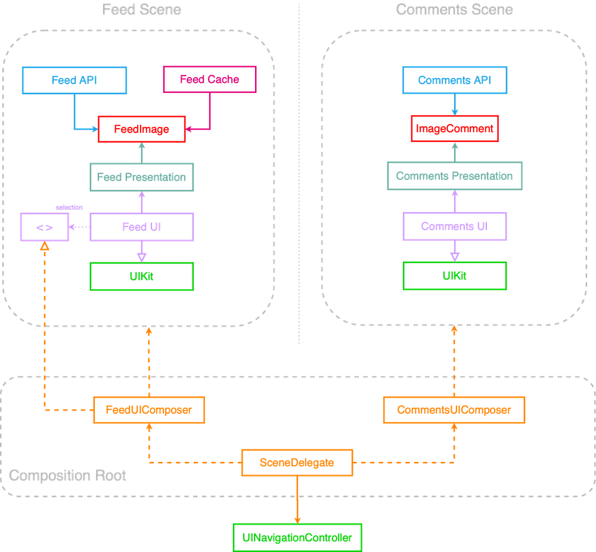

# Essential App Case Study

This is the study repo for the course [iOS Lead Essential](https://iosacademy.essentialdeveloper.com/p/ios-lead-essentials/).

The app is divided in different modules with a clear separation among them. There are two main features: Feed and Comments. For each feature, there are clear use cases and models:

- [Image Feed Feature Specs](/feed_specs.md)
- [Image Comments Feature Specs](/comments_specs.md)

The project is built following a TDD approach for each module.

---

## App Architecture

